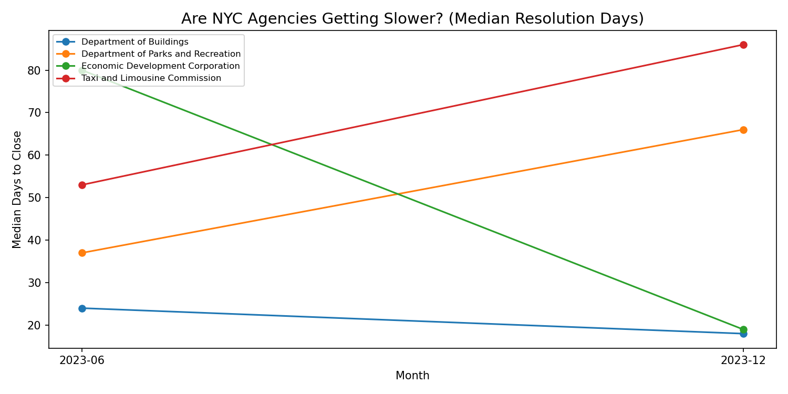

# NYC 311 Agency Response Time Analysis

## Question
Which NYC agencies are most overwhelmed — not by volume, 
but by how long they take to close complaints, 
and is it getting worse over time?

## Finding
Taxi and Limousine Commission and Department of Parks and Recreation 
showed consistent deterioration across 2023, with median resolution 
times increasing 62% and 78% respectively. Economic Development 
Corporation was the only high-volume slow agency that improved 
significantly over the same period.

## Data Source
NYC Open Data — 311 Service Requests (2023)
https://data.cityofnewyork.us/resource/erm2-nwe9.csv

## Methods
- Datetime parsing and resolution time calculation
- Filtered to closed complaints only
- Data-driven agency selection (median > 10 days, min 50 complaints)
- Trend analysis across two time windows

## agency performance over 6 months

## 
